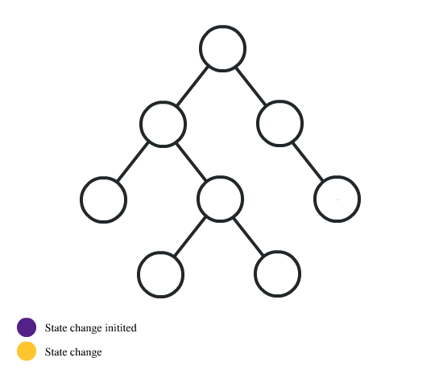

# [React Context API with Project] ()


> এই প্রজেক্ট  মাধ্যমে  রিএক্ট কনটেক্সট এর   মুটামুটি বেসিক ধারণা লাভ করা যাবে। 

> রিএক্ট কনটেক্সট হুক এর মাধ্যমে    ডাটা গুলো যে কোনো কম্পোনেন্ট গুলো  প্রপস ড্রিলিং ছাড়াই  এক্সেস করা  যায়. যার ফলে প্রজেক্ট এর   কোড গুলো অনেক কম হয় এবং ডাটা আদান প্রদান করতে অনেক সহজ হয়. উদাহরণ হিসেবে  একটা  ছবি নিচে দেওয়া হলো - 


####  তিন ধাপের  মাধ্যমে  রিএক্ট কনটেক্সট ব্যবহার করতে  পারি।  সেই ধাপ গুলো  দেওয়া হলো - 
- context তৈরী করা 
- context  এর ভ্যালু গুলোকে provide  করা 
- কনটেক্সট এর ডাটা গুলো বিভিন্ন কম্পোনেন্ট এ ব্যবহার করা 


### context তৈরী করা

    import { createContext } from 'react';
    const Context = createContext('Default Value');

### context  এর ভ্যালু গুলোকে provide  করা

    function Main() {
    const value = 'My Context Value';
    return (
        <Context.Provider value={value}>
        <MyComponent />
        </Context.Provider>
    );
    }

### কনটেক্সট এর ডাটা গুলো বিভিন্ন কম্পোনেন্ট এ ব্যবহার করা 

    import { useContext } from 'react';
    function MyComponent() {
    const value = useContext(Context);
    return <span>{value}</span>;
    }


### Project use Context Api Code 

#### Context.js add

```javascript
import { createContext, useContext, useState } from "react";
import faker from "faker";

const Cart = createContext();
faker.seed(100);

const Context = ({ children }) => {
  const [cart, setCart] = useState([]);

  const productsArray = [...Array(20)].map((p) => ({
    id: faker.datatype.uuid(),
    name: faker.commerce.productName(),
    price: faker.commerce.price(),
    image: faker.random.image(),
  }));

  const [products] = useState(productsArray);

  return (
    <Cart.Provider value={{ cart, setCart, products }}>
      {children}
    </Cart.Provider>
  );
};

export const CartState = () => {
  return useContext(Cart);
};

export default Context;

```
### Index.js 

```javascript
import React from "react";
import ReactDOM from "react-dom";
import "./index.css";
import App from "./App";
import Context from "./Context";

ReactDOM.render(
  <React.StrictMode>
    <Context>
      <App />
    </Context>
  </React.StrictMode>,
  document.getElementById("root")
);

```

### Cart.js 

```javascript 
import { useEffect, useState } from "react";
import { CartState } from "../Context";
import SingleProduct from "./SingleProduct";

const Cart = () => {
  const { cart } = CartState();
  const [total, setTotal] = useState();

  useEffect(() => {
    setTotal(cart.reduce((acc, curr) => acc + Number(curr.price), 0));
  }, [cart]);

  return (
    <div style={{ textAlign: "center" }}>
      <span style={{ fontSize: 30 }}>My Cart</span>
      <br />
      <span style={{ fontSize: 30 }}>Total: {total}</span>
      <div className="productContainer">
        {cart.map((prod) => (
          <SingleProduct prod={prod} key={prod.id} />
        ))}
      </div>
    </div>
  );
};

export default Cart;

```